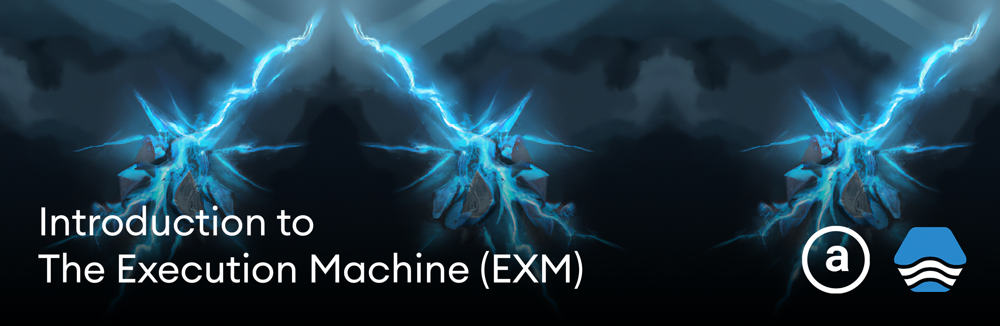

## Introduction to Execution Machine (EXM)

[EXM](exm.dev) is a language-agnostic serverless environment powered by [Arweave](https://www.arweave.org/), and enables developers to create permanent, serverless functions on the blockchain. 



EXM eliminates the need to understand smart contracts, transactions, or blocks to leverage blockchain technology.

EXM / Arweave provide something that most traditional data stores do not - permanence. Once the data / transactions are stored, they can be retrieved and consumed forever (or as long as the network exists).

Some interesting use cases might be registries, games, CMSs, permanent data protocols, general data processing, and possibly even building a permanent NoSQL database.

Under the hood, EXM utilizes [SmartWeave](https://docs.exm.dev/trustless-serverless-functions/introduction/function-standard)

### Lazy Evaluation

The Smartweave (and therefore EXM) execution layer is based on what's known as "Lazy Evaluation".

In most blockchains, the computation and current state is executed by the blockchain nodes. With lazy evaluation, the burden of execution is shifted to either the client or a middle layer (like EXM) that implements a [processor and conveyor](https://docs.exm.dev/concepts/verifiable-computing#how-does-it-work) that essentially re-evaluates and caches the latest state of the contract so that the client does not need to process all previous transactions in order to calculate the current state.

### CLI vs SDK

You can interact with EXV either via their [CLI](https://docs.exm.dev/cli/introduction) or their [SDK](https://docs.exm.dev/trustless-serverless-functions/introduction/js-sdk). In this tutorial we'll be interacting with the platform using the [JavaScript SDK](https://docs.exm.dev/trustless-serverless-functions/introduction/js-sdk).

## Hello World tutorial

Let's explore how to build, deploy, and test an EXM app.

In this example we'll create a basic CMS that will allow a user to create, update, and delete a post. This example will enable us to implement a basic [CRUD app](https://www.google.com/search?q=crud+app&oq=crud+app&aqs=chrome..69i57.1281j0j4&sourceid=chrome&ie=UTF-8) which is the basis for most real-world applications.

### Prerequisites

To be successful with this tutorial you must have:

1. An EXM API key. You can get one [here](https://exm.dev/)
2. Node.js installed on your machine. I recommend installing Node.js either via [NVM](https://github.com/nvm-sh/nvm) or [FNM](https://github.com/Schniz/fnm)
3. Mocha installed globally

### Getting started

To get started, we'll create a new Node.js project in an empty directory:

```sh
npm init --y
```

Next, we'll install the dependencies we'll need for our app:

```sh
npm install @execution-machine/sdk uuid chai
```

Finally, update `package.json` to add this configuration to enable ES Modules:

```json
"type": "module",
```

### Basic setup

For a basic EXM app you need these basic components:

1. Initial state for the program
2. A handler function to manage state updates. This function is the entry point for your EXM function. For a write operation to be considered valid as well as able to change the state of the function, it needs to return an object with state property in it. (more on this later)
3. A script to deploy the program
4. Scripts to read and update the state of the program

### Configuring EXM

To interact with the platform we'll need some basic configuration that we can set up and reuse.

First, make sure you've created an EXM API key [here](https://exm.dev/).

Next, create and set an environment variable either in your local config file, or from your terminal:

```sh
export EXM_PK=<your-api-key>
```

Now, create a new file named `exm.js` and add the following code:

```javascript
/* exm.js */
import { Exm } from '@execution-machine/sdk'

const APIKEY = process.env.EXM_PK
export const exmInstance = new Exm({ token: APIKEY })
```

Now we'll be able to interact with EXM by importing `exmInstance`.

### Initial State

As mentioned previously, the app we'll be creating will allow users to create, edit, and delete posts. A post will be an object with the following fields:

```javascript
type Post {
  id: string
  title: string
  content: string
  author: string
}
```

To hold the posts, we can create some data structure to hold a list of posts. I will be using an object but you could also use an array.

To set up this initial state, create a new file named `state.js` and add the following code:

```javascript
/* state.js */
export const state = {
  "posts": {}
}
```

### Handler function

Now that we have the initial state defined we'll create the [handler](https://docs.exm.dev/trustless-serverless-functions/introduction/function-standard#handler) function.

Create a new file named `handler.js` and add the following code:

```javascript
/* handler.js */
export async function handle(state, action) {
  const { input } = action
  if (input.type === 'createPost' || input.type === 'updatePost') {
    state.posts[input.post.id] = input.post
  }
  if (input.type === 'deletePost') {
    delete state.posts[input.postId]
  }
  return { state }
}
```

This function will accept three different types of actions:

`createPost` - Creates a new post
`updatePost` - Updates an existing post with new data
`deletePost` - Deletes a post

If the input `type` does not match any of these, then the state is just returned without any update.

### Deploy script

Now that we have the state and the handler function defined, we can create the deploy script.

This script will deploy our function to EXM and make it available for us to start using.

Create a new file named `deploy.js` and add the following code:

```javascript
/* deploy.js */
import { ContractType } from '@execution-machine/sdk'
import fs from 'fs'
import { exmInstance } from './exm.js'
import { state } from './state.js'

const contractSource = fs.readFileSync('handler.js')
const data = await exmInstance.functions.deploy(contractSource, state, ContractType.JS)

console.log({ data })

/* after the contract is deployed, write the function id to a local file */
fs.writeFileSync('./functionId.js', `export const functionId = "${data.id}"`)
```

### Creating a new post

Next let's look at how to make a state update.

The first thing we'll want to try to do is to create a new post. Create a new file named `createPost.js` and add the following code:

```javascript
/* createPost.js */
import { exmInstance } from './exm.js'
import { functionId } from './functionId.js'
import { v4 as uuid } from 'uuid'

const id = uuid()

/* the inputs array defines the data that will be available in the handler function as action.input */
const inputs = [{
  type: 'createPost',
  post: {
    id,
    title: "Hello world",
    content: "My first post",
    author: "Nader Dabit"
  }
}]

const data = await exmInstance.functions.write(functionId, inputs)
console.log({ data })
```

As commented in the code above, the most important thing to recognize is the structure of the array of inputs, and how they correlate to the arguments received in the `handler` function.

In `createPost.js`, the `type` will determine the type of state update that is made in the handler, and the `post` is the data used in the state update.

### Reading the current state

Now that we have a way to deploy the function and create a post, let's look at how to read the state.

To do so, create a file named `read.js` and add the following code:

```javascript
/* read.js */
import { exmInstance } from './exm.js'
import { functionId } from './functionId.js'

const data = await exmInstance.functions.read(functionId)
console.log("data: ", JSON.stringify(data))
```

> You can also read the state of any function ID by calling or visiting `https://api.exm.dev/read/<function-id>`

## Trying it out

Now that everything is set up, let's give it a spin!

From your terminal, run the deploy script:

```sh
node deploy.js
```

Once the function has been deployed, you should see a new file written to the project named `functionId.js`.

Next, read the current state of the program:

```sh
node read.js
```

The return value of the state should be an empty `posts` object.

Now, create a new post:

```sh
node createPost.js
```

Then read the state of the app again:

```sh
node read.js
```

The return value should now include the new post that was just created.

### Updating and deleting posts

Let's now create the scripts for updating and deleting posts.

For deleting a post, create a file named `deletePost.js` and add the following code:

```javascript
/* deletePost.js */
import { exmInstance } from './exm.js'
import { functionId } from './functionId.js'

const inputs = [{
  type: 'deletePost',
  postId: process.argv[2]
}];

await exmInstance.functions.write(functionId, inputs)
```

This script takes a post ID as input from the user running the script, and uses it to call the `deletePost` input, passing in the `postId` as an argument.

To update a post, create a new file named `updatePost.js` and add the following code:

```javascript
/* updatePost.js */
import { exmInstance } from './exm.js'
import { functionId } from './functionId.js'

const inputs = [{
  type: 'updatePost',
  post: {
    id: process.argv[2],
    title: "Hello world V2",
    content: "My updated post!",
    author: "Nader Dabit"
  }
}]

const data = await exmInstance.functions.write(functionId, inputs)

console.log({ data })
```

Now, you should be able to update and delete posts by running these two scripts, passing in the post ID:

```sh
node deletePost.js <post-id>
```

## Testing

EXM also comes built in with testing functions in their SDK to facilitate testing in a way that can be readable & efficient.

Let's create a test script that will check that all of our action types work as we expect.

Create a new file named `test.js` and add the following code:

```javascript
import fs from 'fs'
import { TestFunction, createWrite, FunctionType } from "@execution-machine/sdk"
import { state } from './state.js'
import { v4 as uuid } from 'uuid'
import { expect } from 'chai'

const id = uuid()
const functionSource = fs.readFileSync('./handler.js')

const createPost = {
  type: 'createPost',
  post: {
    id,
    title: "Hello world",
    content: "My first post",
    author: "Nader Dabit"
  }
}

const updatePost = {
  type: 'updatePost',
  post: {
    id,
    title: "Hello world V2",
    content: "My updated post!",
    author: "Nader Dabit"
  }
}

const deletePost = {
  type: 'deletePost',
  postId: id
}

describe("Testing EXM", function () {
  it("Should create a post", async function () {
    const testAttempt = await TestFunction({
      functionSource,
      functionType: FunctionType.JAVASCRIPT,
      functionInitState: state,
      writes: [createWrite(createPost)]
    })
    const value = testAttempt.state.posts[id]

    expect(value.id).to.equal(id)
    expect(value.title).to.equal("Hello world")
  })

  it("Should update a post", async function () {
    const testAttempt = await TestFunction({
      functionSource,
      functionType: FunctionType.JAVASCRIPT,
      functionInitState: state,
      writes: [createWrite(createPost), createWrite(updatePost)]
    })
    const value = testAttempt.state.posts[id]
    expect(value.title).to.equal("Hello world V2")
  })

  it("Should delete a post", async function () {
    const testAttempt = await TestFunction({
      functionSource,
      functionType: FunctionType.JAVASCRIPT,
      functionInitState: state,
      writes: [createWrite(createPost), createWrite(deletePost)]
    })
    const value = testAttempt.state.posts
    const length = Object.keys(value).length
    expect(length).to.equal(0)
  })
})
```

To test, run the following command:

```sh
mocha test.js
```

## Next steps

To learn more about EXM, check out the [EXM Discord](https://discord.com/invite/7z7PRdXZqm).

To learn more about the Arweave Developer Ecosystem, check out [learn.arweave.dev](learn.arweave.dev).